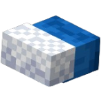

# Accessories

Accessories are **3D items** that add a variety of options to customize and enhance your Minecraft character's appearance, including :
- hats
- backpacks
- *and more*

## Updating

To update your COSMOSTIC account active accessories, follow these steps :
1. On the [dashboard](https://cosmostic.letz.dev/dashboard), click *Edit* button of the *accessories* category.
2. Select up to 5 accessories from a **various collection**.
3. Click **SAVE** button.

## Example

