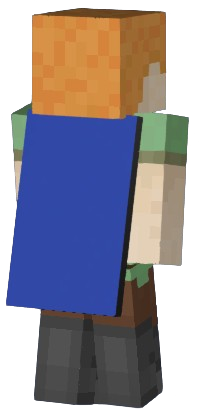

# Capes

Capes are well-known cosmetic items that can add a unique flair to your Minecraft character.

## Updating

To update your COSMOSTIC account active cape, follow these steps :
1. On the [dashboard](https://cosmostic.letz.dev/dashboard), click *Edit* button of the *cape* category.
2. Choose the cape you want from a **various collection**.
3. Click **UPDATE** button.

## Example

